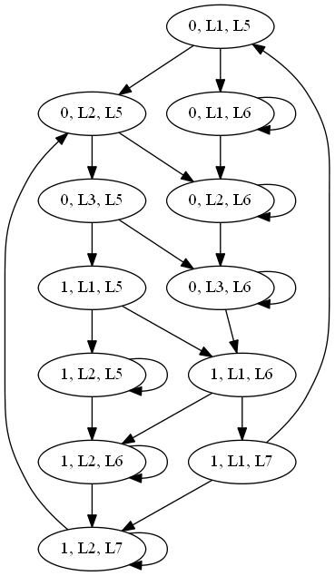
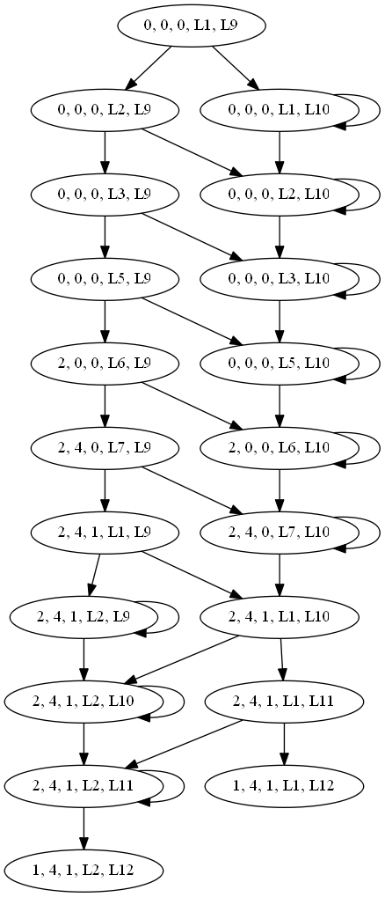

# Translate the concurrent program to the Kripke Structure
    

## Usage
```
python core.py testCode/teacher.txt 20
```

* `testCode/teacher.txt`: location of the code-txt you wanna test.
* `20`: number of the nodes you wanna generate.

## IMP language

1. Aexp: a=n|X|a+a|a-a|a*a, n∈[0, 2]
2. Bexp: b=true|false|a==a|a<=a|not b|b and b|b or b
3. Com: c=|X=a|a;b|if b then c else c endif|while b do c endwhile|wait(b)|skip

> Specification: Here `a`, `b` and `c` indicates the variables, expressions and sentences.

## version 1.0

In the first version, we only consider the single program without concurrence. And `If` and `While` won't be nested inside each other.

### Result

```
//Input: testCode/imp.txt
```

```
//Output:
*********************Label Program***************************
L1: a = 1
L2: b = a
L3: if (a<=b) then
L4: c = a + b
else
L5: d = c - b
endif
L6: while (true) do
L7: e = c * d
L8: f = 0
endwhile
L9: if (notf) then
L10: g = f + e
else
L11: h = g * 2
endif
*********************Label Formula***************************
pc = L1 ^ pc' = L2 ^ a' = 1
pc = L2 ^ pc' = L3 ^ b' = a
pc = L3 ^ pc' = L4 ^ (a<=b)
pc = L3 ^ pc' = L5 ^ ¬(a<=b)
pc = L4 ^ pc' = L6 ^ c' = a + b
pc = L5 ^ pc' = L6 ^ d' = c - b
pc = L6 ^ pc' = L7 ^ (true)
pc = L6 ^ pc' = L9 ^ ¬(true)
pc = L7 ^ pc' = L8 ^ e' = c * d
pc = L8 ^ pc' = L6 ^ f' = 0
pc = L9 ^ pc' = L10 ^ (notf)
pc = L9 ^ pc' = L11 ^ ¬(notf)
pc = L10 ^ pc' = L12 ^ g' = f + e
pc = L11 ^ pc' = L12 ^ h' = g * 2
```

## version 2.0

In the second version, we consider two concurrent programs. And `If` will occure in `While` segment. 'Wait' and 'Skip' are also added.

### Result

```
//Input: testCode/concurrent-1.txt
```

```
//Output:
*********************Label Program***************************
L1: while (true) do
L2: wait (d==0)
L3: if (a>1) then
L4: skip
else
L5: a = a + 2
L6: b = a * 2
endif
L7: d = 1
endwhile
*********************Label Formula***************************
pc = L1 ^ pc' = L2 ^ (true)
pc = L1 ^ pc' = L8 ^ ¬(true)
pc = L2 ^ pc' = L3 ^ (d==0)
pc = L2 ^ pc' = L2 ^ ¬(d==0)
pc = L3 ^ pc' = L4 ^ (a>1)
pc = L3 ^ pc' = L5 ^ ¬(a>1)
pc = L4 ^ pc' = L7 ^ Same(U)
pc = L5 ^ pc' = L6 ^ a' = a + 2
pc = L6 ^ pc' = L7 ^ b' = a * 2
pc = L7 ^ pc' = L1 ^ d' = 1
*********************Label Program***************************
L9: while (true) do
L10: wait (d==1)
L11: a = 1
L12: b = 1
L13: if (b>0) then
L14: a = a + 1
L15: b = b - 1
endif
L16: d = 0
endwhile
*********************Label Formula***************************
pc = L9 ^ pc' = L10 ^ (true)
pc = L9 ^ pc' = L17 ^ ¬(true)
pc = L10 ^ pc' = L11 ^ (d==1)
pc = L10 ^ pc' = L10 ^ ¬(d==1)
pc = L11 ^ pc' = L12 ^ a' = 1
pc = L12 ^ pc' = L13 ^ b' = 1
pc = L13 ^ pc' = L14 ^ (b>0)
pc = L13 ^ pc' = L17 ^ ¬(b>0)
pc = L14 ^ pc' = L15 ^ a' = a + 1
pc = L15 ^ pc' = L16 ^ b' = b - 1
pc = L16 ^ pc' = L9 ^ d' = 0
```

## version 3.0
Finally, we successfully added the drawing graph function. And we use the [Graphviz](http://www.graphviz.org/)

### How to use Graphviz in Python ?(Windows for example)

1. Download MSI [here](https://graphviz.gitlab.io/_pages/Download/Download_windows.html) and install it.
2. Add its `bin` path to your PC's `Environment Path`.
3. pip install graphviz. 

### Result

1. Teacher' Example(testCode/teacher.txt)
   
   
2. Intricate Example(testCode/concurrent-1.txt): only show the 20 nodes(not fully).
   
   

## version 3.1
We use the `argparse`, now you can assign the code-txt location and the number of generated nodes.

## version 3.2
Add code commenting.

## Thanks the course in the [极客时间](https://time.geekbang.org/column/intro/100034101)